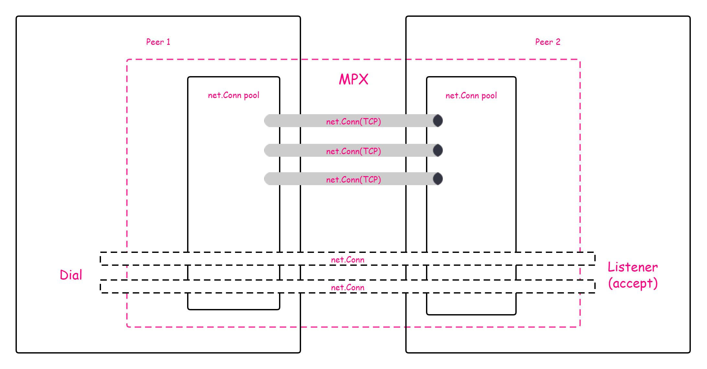

# mpx
<p align="left">
<a href="https://github.com/fregie/mpx/actions?query=workflow%3ABuild"></a>
<a href="https://goreportcard.com/report/github.com/fregie/mpx"></a>
<a href="https://pkg.go.dev/github.com/fregie/mpx"></a>
<a href="https://opensource.org/licenses/GPL-3-Clause"></a>
</p>

  
通用连接多路复用协议

## 用途
* 复用已有连接，省去握手时间。可用于解决websocket+CDN代理场景下建立连接握手时间太长
* 聚合多个IP/服务器，同时聚合带宽，多个低带宽服务器聚合成高带宽
* 某些情况下聚合多条TCP连接可以提高峰值带宽

## 使用 mpx-tunnel
mpx-tunnel使用多个TCP连接承载

### 源码编译安装部署
#### 安装
```bash
go install github.com/fregie/mpx/mpx-tunnel@latest
```
#### 服务端
以go-shadowsocks2举例，首先在服务器启动ss服务端:
```bash
go-shadowsocks2 -s 'ss://AEAD_CHACHA20_POLY1305:your-password@:8488' -verbose
```
在服务器启动mpx server,转发连接到ss服务端端口
```bash
# 指定target则为服务端
mpx-tunnel -listen 0.0.0.0:5512 -target 127.0.0.1:8848
```
或使用docker部署
```bash
docker run -d --restart=always --name mpx -p 5512:5512 -e LISTEN_ADDR="0.0.0.0:5512" -e TARGET_ADDR="127.0.0.1:8848" fregie/mpx:latest
```
#### 客户端
启动mpx client
```bash
# 指定server则为客户端 
mpx-tunnel -listen 0.0.0.0:5513 --server server-ip:5512 -p 4
```
或使用docker部署
```bash
docker run -d --restart=always --name mpx -p 5512:5512 -e LISTEN_ADDR="0.0.0.0:5512" -e SERVER_ADDR="server-ip:5512" fregie/mpx:latest
```

`-p`:配置保持的长连接数量  
启动ss客户端
```bash
go-shadowsocks2 -c 'ss://AEAD_CHACHA20_POLY1305:your-password@127.0.0.1:5513' -socks :1080 -verbose
```

#### 聚合不同IP的连接
假如你有两台XX云30mbps轻量级服务器`server-1`,`server-2`,在同一个内网中，公网ip分别为`public-ip-1`,`public-ip-2`,内网ip分别为`private-ip-1`,`private-ip-2`。
1. 在`server-1`按以上方法部署`mpx-ser`以及`ss server`
2. 在`server-2`配置通过iptables端口转发,转发`6666`端口到`server-1`的`5512`端口
```bash
echo "net.ipv4.ip_forward = 1" >> /etc/sysctl.conf
sysctl -p
iptables -t nat -I POSTROUTING  -j MASQUERADE
iptables -t nat -I PREROUTING -p tcp --dport 6666 -j DNAT --to-destination private-ip-1:5512
iptables -t nat -I POSTROUTING -d private-ip-1 -p tcp --dport 5512 -j SNAT --to-source private-ip-2
```
3. 在客户端使用以下命令启动`mpx-cli`:
```bash
mpx-tunnel -listen 0.0.0.0:5513 -server "public-ip-1:5512|2,public-ip-2:6666|2" -p 4
# 使用docker部署
docker run -d --restart=always --name mpx -p 5512:5512 -e LISTEN_ADDR="0.0.0.0:5512" -e SERVER_ADDR="public-ip-1:5512|2,public-ip-2:6666" fregie/mpx:latest
```
`-s`: 使用`,`分割不同服务端，`|`前为服务端地址`ip:port`,`|`之后为权重，会根据其权重来分配对应地址承载的带宽。例如你有一台30m和一台60m的服务器，那你应该将其权重配为`1:2`

4. 按上面的方法启动`ss client`

## 原理



mpx是一个基于标准库 `net` 中interface同时也实现了 `net` 库中部分interface的连接多路复用库。  

### 输入

mpx接受任何实现了 `net.Conn` 接口的连接作为输入。  
可以直接调用 `AddConn` 方法将Conn输入，也可以调用 `ServeWithListener` 输入一个 `net.Listener` ，调用 `StartWithDialer` 输入一个 `dailer` (mpx库中的一个interface)来使用mpx

### 输出

mpx提供给调用者一个名为 `ConnPool` 的struct。  
该struct实现了 `net.Listener` 供服务端调用，同时提供一个 `dial` 方法供客户端建立连接(返回一个 `net.Conn` )。

## TODO
- [ ] 支持丢包重传
- [x] 输入连接可用性检测
- [x] 支持配置输入连接权重

## 集成
### 安装
```shell
go get github.com/fregie/mpx
```
### 服务端(TCP)
```go
import (
  "github.com/fregie/mpx"
  "net"
)

func main(){
  lis, _ := net.Listen("tcp", "0.0.0.0:5512")
  // Skip exception handling here
  cp := mpx.NewConnPool()
  go cp.ServeWithListener(lis)
  for {
    conn, _ := cp.Accept()
    // Skip exception handling here
    go func(){
      defer conn.Close()
      // Do something with conn(net.Conn)
    }
  }
}
```

### 客户端(TCP)
```go
import (
  "github.com/fregie/mpx"
  "net"
)

type TCPDialer struct {
  ServerAddr string
}
func (t *TCPDialer) Dial() (net.Conn, error) {
	return net.Dial("tcp", t.ServerAddr)
}

func main(){
  cp := mpx.NewConnPool()
  cp.StartWithDialer(&TCPDialer{ServerAddr: "ip:port"}, 5)
  conn, _ := cp.Dial(nil)
  // Skip exception handling here
  defer conn.Close()
  // Do something with conn(net.Conn)
  conn.Write([]byte("something"))
}

```